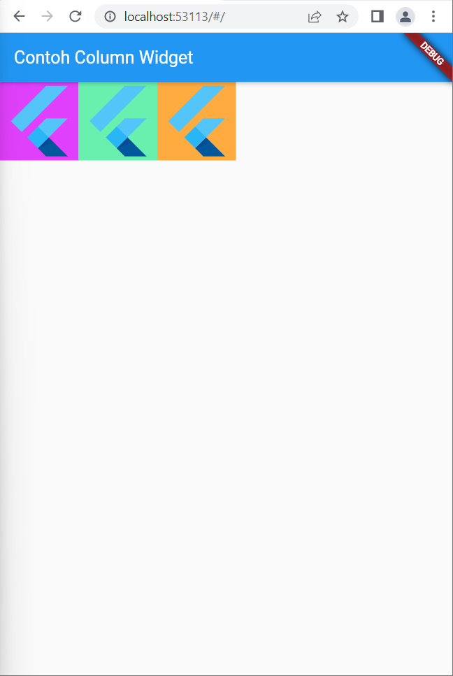

# basic_flutter_application

<h3> Nama : Maulana Rosandy </h3>
<h3> NIM : 2041720120 </h3>

<h3> Build in Widget </h3>

<table>
  <tr>
    <th>Text Widget</th>
    <th>Image Widget</th>
    <th>Material Design dan iOS Cupertino </th>
  </tr>
  <tr>
    <td>
        
    </td>
    <td>
        
    </td>
    <td>
        
    </td>
  </tr>

  <tr>
    <th>Button</th>
    <th>Scaffold</th>
    <th>Dialog</th>
  </tr>
  <tr>
    <td>
        
    </td>
    <td>
        
    </td>
    <td>
        
    </td>
  </tr>

  <tr>
    <th>Input dan Selection Widget </th>
    <th>Date and Time Pickers </th>
  </tr>
  <tr>
    <td>
        
    </td>
    <td>
        
    </td>
  </tr>

</table>

<h3> Layout Widget </h3>

<table>
    
Container

  <tr>
    <th>property child</th>
    <th>property alignment</th>
    <th>property color</th>
  </tr>
  <tr>
    <td>
        
    </td>
    <td>
        
    </td>
    <td>
        
    </td>
  </tr>

  <tr>
    <th>Property height dan width</th>
    <th>property margin</th>
    <th>property padding</th>
  </tr>
  <tr>
    <td>
        
    </td>
    <td>
        
    </td>
    <td>
        
    </td>
  </tr>

  <tr>
    <th>property transform</th>
    <th>property decoration</th>
  </tr>
  <tr>
    <td>
        
    </td>
    <td>
        
    </td>
  </tr>

</table>

<h3> Row dan Column </h3>

<table>
  <tr>
    <th>Column Widget</th>
    <th>Row Widget</th>
    <th>Stack</th>
  </tr>
  <tr>
    <td>
        
    </td>
    <td>
        
    </td>
    <td>
        
    </td>
  </tr>

  <tr>
    <th>ListView</th>
    <th>GridView </th>
  </tr>
  <tr>
    <td>
        
    </td>
    <td>
        
    </td>
  </tr>

</table>

<h3> Jobsheet </h3>

<table>
  <tr>
    <th>Screenshot 1</th>
    <th>Screenshot 2</th>
  </tr>
  <tr>
    <td>
        
    </td>
    <td>
        
    </td>
  </tr>

</table>